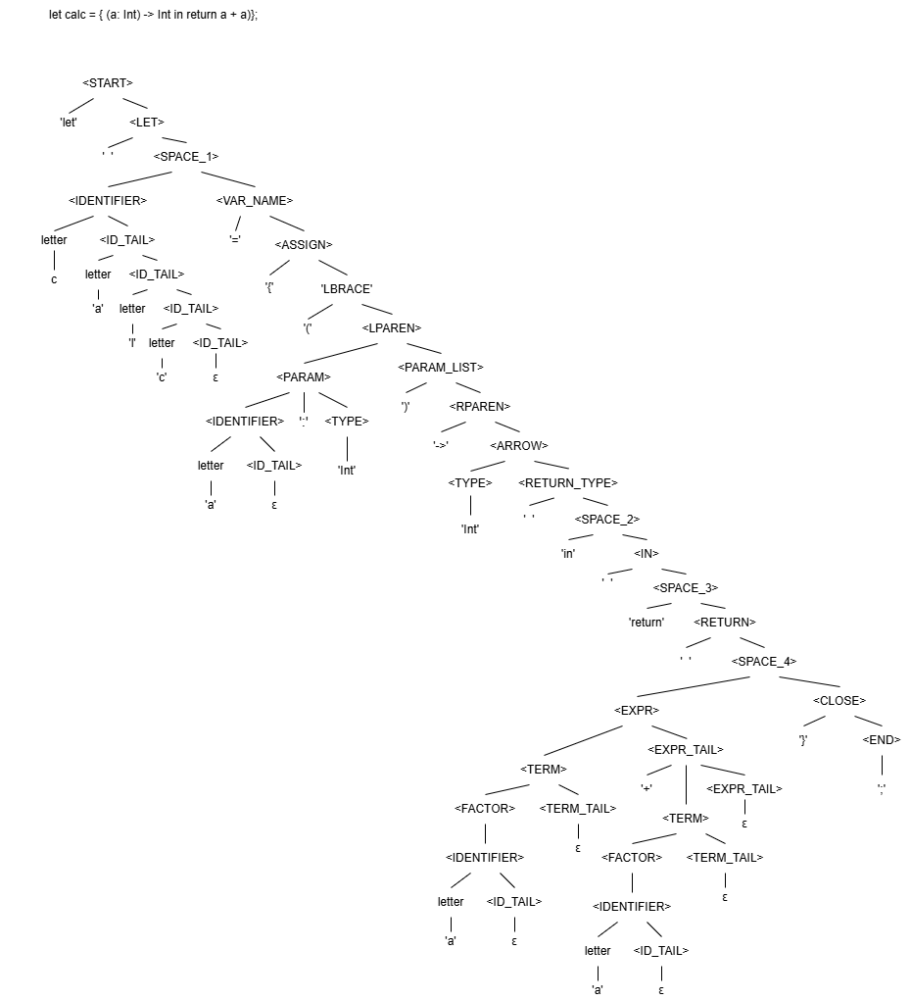
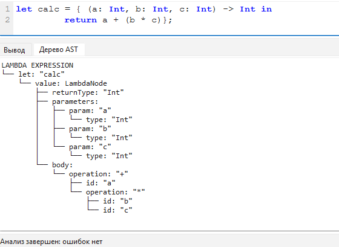
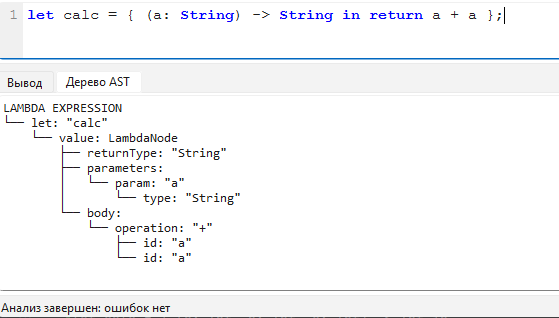
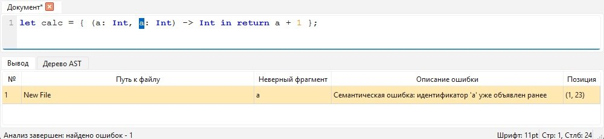
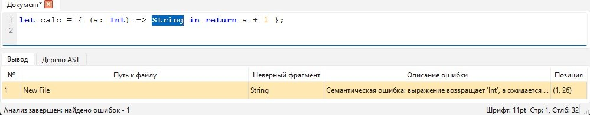
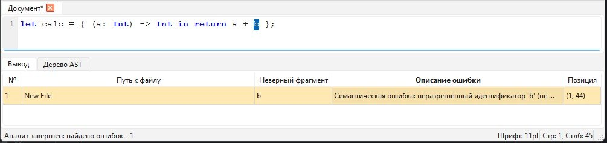
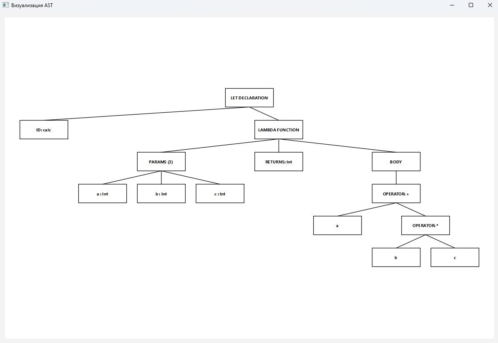
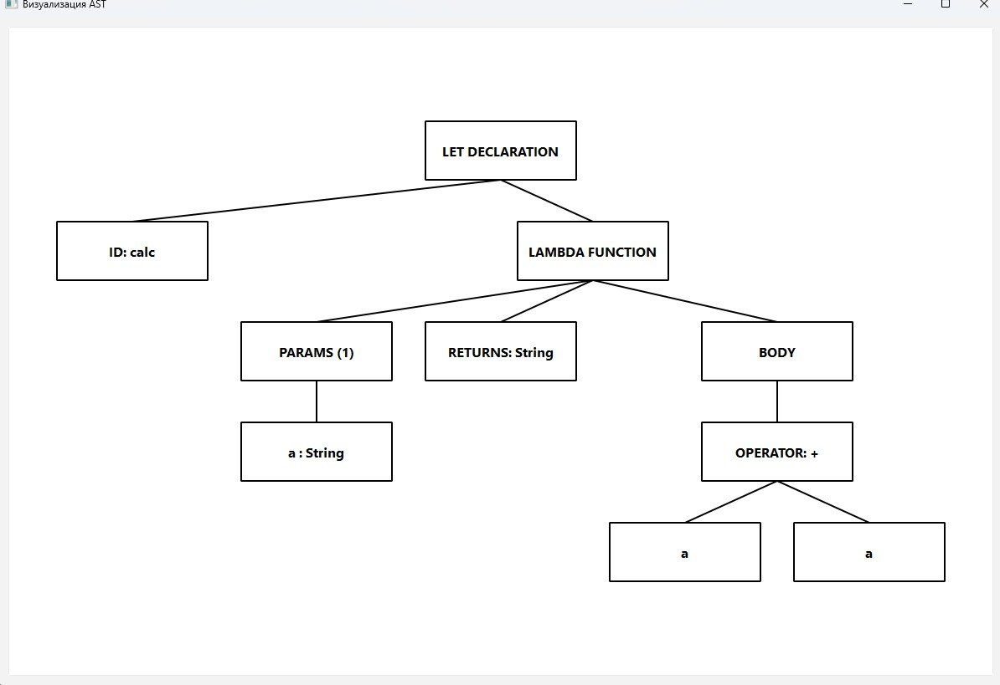

# Лабораторная работа 5. Построение AST и проверка контекстно-зависимых условий
## Цель работы
Изучить назначение и принципы работы семантического анализатора в структуре компилятора. Освоить методы построения абстрактного 
синтаксического дерева (AST) 
и проверки контекстно-зависимых условий (семантических правил) для заданной синтаксической конструкции.
## Сведения об авторе
Лабораторную работу выполнила студентка группы АВТ-313, Ижболдина Виолетта
## Постановка задачи
Развить ранее созданный синтаксический анализатор (парсер) до семантического: построить абстрактное синтаксическое дерево (AST) 
и реализовать проверку контекстно-зависимых условий в соответствии с индивидуальным вариантом курсовой работы.
## Вариант задания
87, Лямбда-выражение на языке Swift
### Примеры корректных строк:
let calc = { (a: Int, b: Int, c: Int) -> Int in
return a + (b * c)
};

let calc = { (a: String) -> String in return a + a };

## Контекстно-зависимые условия
### Правило 1 (уникальность идентификаторов)
let calc = { (a: Int, a: Int) -> Int in return a + 1 };

Семантическая ошибка: идентификатор 'a' уже объявлен ранее

### Правило 2 (совместимость типов)
let calc = { (a: Int) -> String in return a + 1 };
 
Семантическая ошибка: выражение возвращает 'Int', а ожидается 'String'

### Правило 3 (допустимые значения)
let calc = { (a: Int) -> Int in return 9999999999 };

Семантическая ошибка: значение 9999999999 выходит за пределы 32-битного Int

### Правило 4 (использование идентификаторов)
let calc = { (a: Int) -> Int in return a + b };

Семантическая ошибка: неразрешенный идентификатор 'b' (не объявлен)

## Структура AST
### Описание узлов 

### Рисунок AST для верной строки 

### Формат вывода AST в программе
Строка: "let calc = { (a: Int, b: Int, c: Int) -> Int in
return a + (b * c)};"

Строка: "let calc = { (a: String) -> String in return a + a };"

## Тестовые примеры 
### Уникальность идентификаторов

### Совместимость типов

### Допустимые значения

### Использование идентификаторов

## Дополнительное задание
### Использованные графические средства

## Тестовые примеры 
Строка: "let calc = { (a: Int, b: Int, c: Int) -> Int in
return a + (b * c)};"

Строка: "let calc = { (a: String) -> String in return a + a };"

## Инструкция по запуску
1. Требования
   - Python версии 3.8 или выше.
   - Менеджер пакетов pip
2. Установка зависимостей
   - Для работы приложения необходима библиотека PyQt6. Установить библиотеку можно с помощью команды: pip install PyQt6
3. Сборка проекта
   - Для того чтобы собрать проект в .exe, нужно использовать библиотеку PyInstaller: pip install pyinstaller
   - Запустить сборку командой: pyinstaller --onefile --windowed --name TextEditor main.py
     
### Путь к готовому исполняемому файлу
Готовый файл находится в папке dist в корне проекта.
