# Лабораторная работа 7. Анализ и преобразование кода с использованием Clang и LLVM
## Цель работы
Познакомиться с инструментарием Clang и LLVM, освоить получение абстрактного синтаксического дерева (AST) и 
промежуточного представления (LLVM IR) для кода на C/C++, научиться применять базовые оптимизации, 
строить графы потока управления (CFG), 
а также анализировать влияние оптимизаций на различные синтаксические конструкции языка.
## Сведения об авторе
Лабораторную работу выполнила студентка группы АВТ-313, Ижболдина Виолетта
## Постановка задачи
### Общее задание

Необходимо выполнить следующие шаги:
1. Установка среды  
Установить Clang, LLVM, opt и Graphviz (например, в Ubuntu 26.04).  
2. Работа с AST  
Сгенерировать абстрактное синтаксическое дерево для заданного C/C++‑файла.  
3. Генерация LLVM IR  
Получить промежуточное представление кода без оптимизаций (-O0) и с оптимизациями (-O2).  
4. Оптимизация IR  
Применить оптимизации с помощью opt и/или флагов Clang, сравнить изменения.  
5. Построение CFG  
Построить граф потока управления для одной или нескольких функций.  
6. Индивидуальное задание (по варианту)   
Выполнить анализ конкретной синтаксической конструкции в соответствии с вариантом. 
Сформулировать, как LLVM обрабатывает выбранную конструкцию, какие оптимизации применяются.
7. Выводы  
Ответить на контрольные вопросы  

Пример кода: 
```
#include <stdio.h>
int square(int x) {
 return x * x;
}
int main() {
 int a = 5;
 int b = square(a);
 printf("%d\n", b);
 return 0;
}
```

### Индивидуальное задание

Задания:
1. Получить AST, указав как представлена лямбда-функция.
2. Получить IR для -O0 и найти замыкание.
3. Получить IR для -O2 и указать, во что превратилась
лямбда-функция?
4. Постройте CFG.
5. Вывод: лямбда — синтаксический сахар или отдельный тип.
Сделайте вывод о том, являются ли лямбда-выражения отдельным типом
или “синтаксическим сахаром”?


Пример кода: 
```
int main() {
auto square = [](int x) -> int { return x * x; };
int a = 5;
int b = square(a);
return b;
}
```

## Общее задание
### Установка среды
Работа выполнялась в среде Ubuntu 24.04.   
Установлены следующие инструменты:
- clang - компилятор языка C/C++;  
- llvm - инструменты анализа и оптимизации кода;  
- opt - инструмент для работы с LLVM IR и применения оптимизаций;  
- Graphviz - инструмент для визуализации кода.  
>Команды установки:   
> sudo apt install clang llvm  
> sudo apt install opt  
> sudo apt install graphviz  

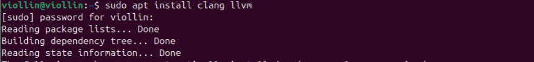
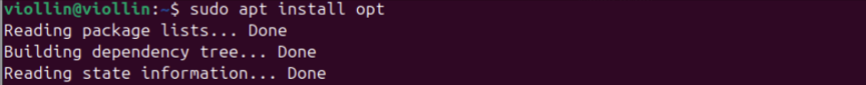


### Работа с AST
Исходный файл main.c
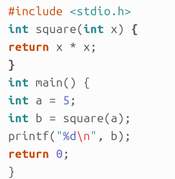

> Команда: clang -Xclang -ast-dump -fsyntax-only main.c
> [AST_command.png](images/GENERAL_PART/AST_command.png)

Получение AST:
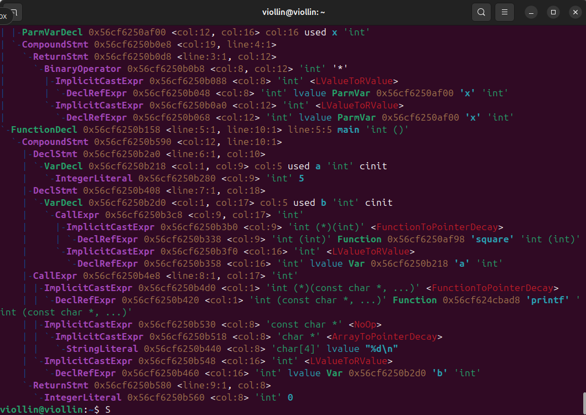


### Генерация LLVM IR

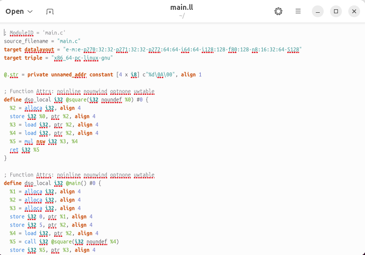


### Оптимизация IR
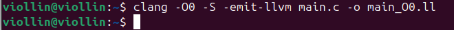
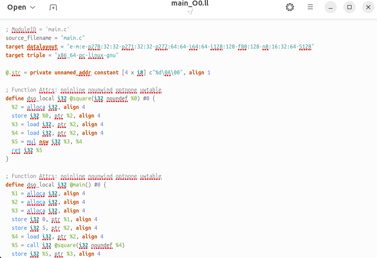

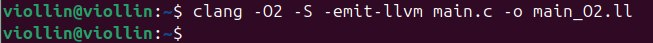
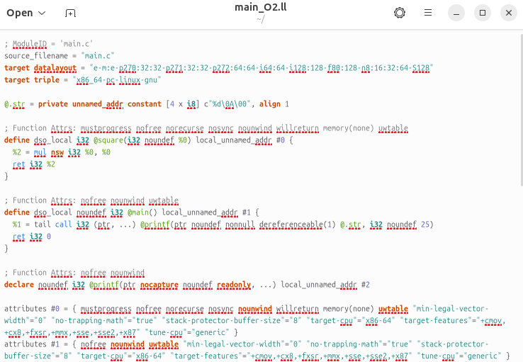

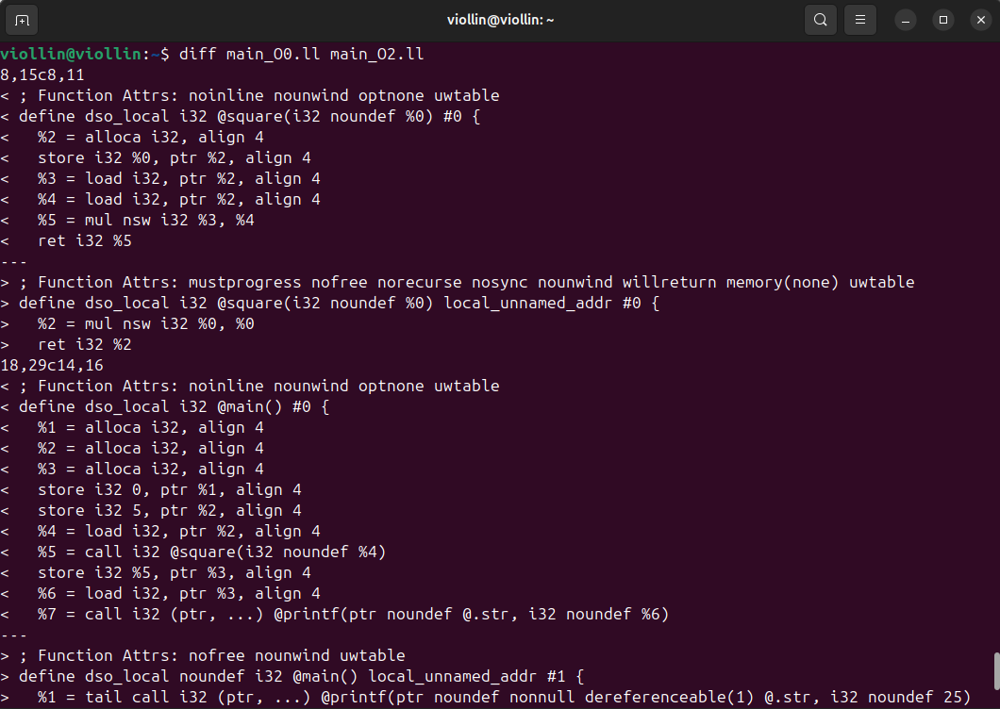


### Построение CFG
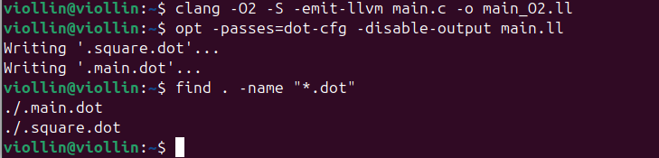
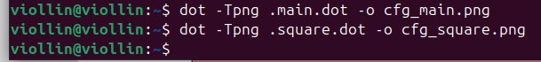

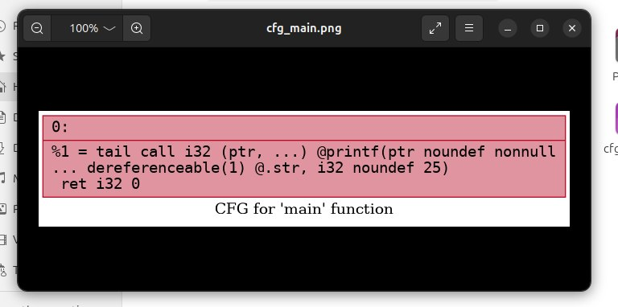
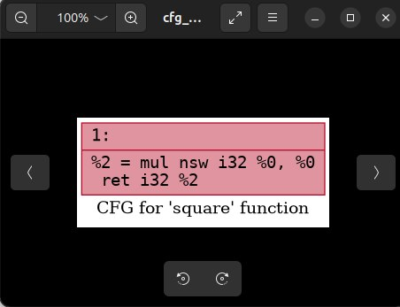


## Индивидуальное задание
### Получение AST

### Получение IR для -O0 

### Получение IR для -O2

### Построение CFG

### Вывод: лямбда — синтаксический сахар или отдельный тип?

### Ответы на контрольные вопросы
**1. Что такое Clang, и какова его роль в процессе компиляции программ?**  
Clang - это фронтенд-компилятор для языков C, C++ и Objective-C. Его роль заключается в том, 
чтобы взять исходный текст программы, провести лексический, синтаксический и семантический анализ, 
построить абстрактное синтаксическое дерево и затем сгенерировать из него промежуточное представление.

**2. Что представляет собой LLVM и как он используется в современных компиляторах?**     
LLVM - это набор модульных и переиспользуемых технологий для построения компиляторов. 
В современных компиляторах LLVM используется как мощный движок оптимизации: 
он принимает независимый от языка LLVM IR, применяет к нему сотни различных алгоритмов оптимизации и затем генерирует 
машинный код (ассемблер) под конкретную архитектуру процессора.

**3. Чем отличается абстрактное синтаксическое дерево (AST) от промежуточного представления LLVM IR?**  
AST - это древовидное представление структуры исходного кода. 
Оно сильно привязано к правилам конкретного языка (в нем есть классы, циклы for, if-else, лямбды и т.д.).  
LLVM IR - это линейный набор низкоуровневых инструкций, похожий на ассемблер, но независимый от процессора. 
В нем нет сложных конструкций вроде for или class - только переходы, выделение памяти, простые арифметические операции и вызовы.

**4. Для чего необходимо промежуточное представление (IR) в процессе компиляции?**  


**5. Что делает инструкция alloc в LLVM IR, и зачем она используется в функциях?**  
Инструкция alloca выделяет память на стеке текущей функции для локальных переменных
и возвращает указатель на эту память. Она используется, потому что в LLVM IR виртуальные регистры 
(обозначаются через %) неизменяемы, а исходные переменные в C++ могут меняться (например, в циклах). 
alloca позволяет создать изменяемую область памяти для хранения таких переменных до того, как код будет оптимизирован.

6. Зачем нужна оптимизация кода в компиляторе, и какие
основные цели она преследует?
7. Что такое SSA-форма и почему она важна при оптимизации
программ?
8. Что такое граф потока управления (CFG) и как он помогает
анализировать поведение программы?
9. Как устроено представление арифметических операций в
LLVM IR (например, умножение, сложение)?
10. Почему функции в LLVM IR обычно представляют собой
отдельные единицы анализа и оптимизации?
11. Что происходит с функцией в LLVM IR, если она вызывается
один раз и очень короткая?
12. Какие преимущества даёт использование IR и CFG для
автоматических оптимизаций по сравнению с анализом исходного текста
на C?

## Дополнительное задание 
