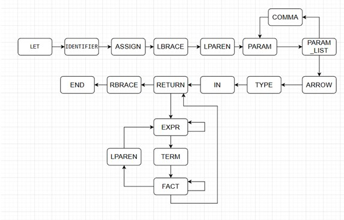
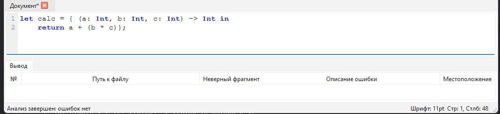
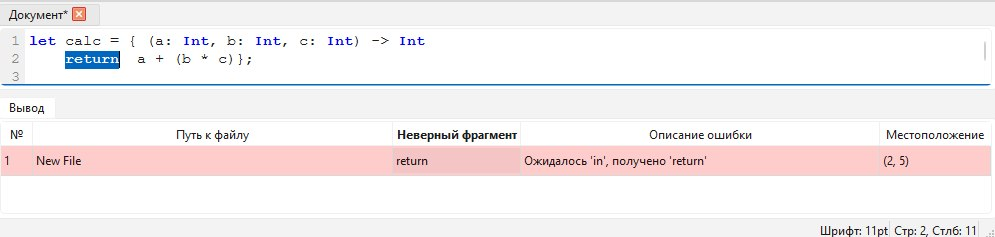
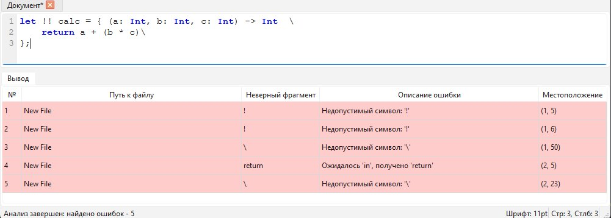
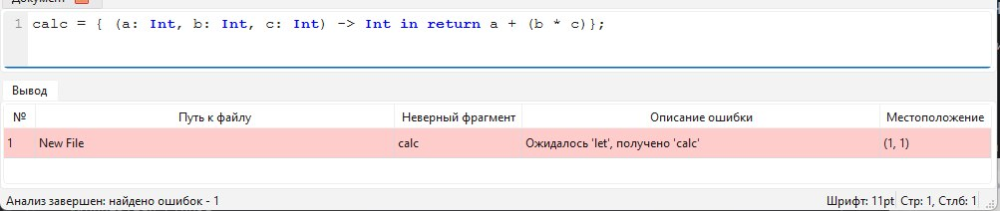

# Лабораторная работа 3. Разработка синтаксического анализатора (парсера)
## Цель работы
Изучить назначение и принципы работы синтаксического анализатора в 
структуре компилятора. Спроектировать грамматику, построить соответствующую схему 
метода анализа грамматики и выполнить программную реализацию парсера с нейтрализацией 
синтаксических ошибок методом Айронса. Интегрировать разработанный модуль в ранее 
созданный графический интерфейс языкового процессора.
## Сведения об авторе
Лабораторную работу выполнила студентка группы АВТ-313, Ижболдина Виолетта
## Вариант задания
### Вариант:
87, Лямбда-выражение на языке Swift
### Примеры корректных строк: 
1. let calc = { (a: Int, b: Int, c: Int) -> Int in 
    return a + (b * c)};

2. let simple = { (s: String) -> String in return s };

## Разработка грамматики
1.     <START>  -> ‘LET’   <LET>
2.     <LET>   ->  ‘  ’   <SPACE_1>
3.     <SPACE_1> ->  <IDENTIFIER>   <VAR_NAME>
4.     <VAR_NAME>   ->  ‘=’   <ASSIGN>
5.     <ASSIGN>   -> ‘{’ <LBRACE>
6.     <LBRACE>  -> ‘(’ <LPAREN>
7.     <LPAREN>  ->  <PARAM> <PARAM_LIST>
8.     <PARAM>   -> <IDENTIFIER>   ‘:’   <TYPE>   
9.     <TYPE>   -> ‘Int’ | ‘String’ | ‘Float’  | ‘Bool’
10.     <PARAM_LIST> ->  ‘,’ <LPAREN>  |  ‘)’ <RPAREN>
11.     <RPAREN>    ->   ‘->’   <ARROW>
12.     <ARROW>  ->   <TYPE>   <RETURN_TYPE>
13.     <RETURN_TYPE>  ->   ‘ ’  <SPACE_2>
14.     <SPACE_2> ->   ‘in’  <IN> 
15.     <IN>   ->   ‘ ’  <SPACE_3>
16.     <SPACE_3>   ->  ‘return’  <RETURN>
17.     <RETURN>   ->  ‘  ’   <SPACE_4>
18.     <SPACE_4>   ->  <EXPR>  <CLOSE>
19.     <EXPR>    ->   <TERM> <EXPR_TAIL>
20.     <EXPR_TAIL>    ->   ‘+’  <TERM><EXPR_TAIL> | ‘-’ <TERM> <EXPR_TAIL> | ε
21.     <TERM>  ->  <FACTOR>   <TERM_TAIL>
22.     <TERM_TAIL>    ->   ‘*’ <FACTOR><TERM_TAIL> | ‘/’ <FACTOR> <TERM_TAIL> | ε
23.     <FACTOR>   ->  <IDENTIFIER>  |  <NUMBER>  | (<EXPR> )
24.     <CLOSE>  -> ‘}’ <END>
25.     <END>  ->  ‘;’
26.     <IDENTIFIER>   ->  letter <ID_TAIL>
27.     <ID_TAIL>   ->  letter<ID_TAIL> | digit<ID_TAIL> | ε
28.     <NUMBER>   ->  digit <NUM_TAIL>
29.     <NUM_TAIL>   ->  digit<NUM_TAIL> | ε

- letter -> 'a' | 'b' | ... | 'z' | 'A' | 'B' | 'Z'
- digit -> '0' | '1' | ... | '9'
- $V_T$: {'let', '=', '{', '(', ')', ':', ',', '->', 'in', 'return', 
'+', '-', '*', '/', ';', 'Int', 'String', 'Float', 'Bool', letter, digit}.
- $V_N$: {START, LET, SPACE_1, VAR_NAME, ASSIGN, LBRACE, LPAREN, 
PARAM, TYPE, PARAM_LIST, RPAREN, ARROW, RETURN_TYPE, SPACE_2, IN, SPACE_3, RETURN, SPACE_4, 
EXPR, EXPR_TAIL, TERM, TERM_TAIL, FACTOR, CLOSE, END, IDENTIFIER, ID_TAIL, NUMBER, NUM_TAIL}.
- Z = < START >

## Грамматика ANTLR

````
grammar MyGrammar;

startRule    : 'let' varName assign ;
varName      : ID ;
assign       : '=' lbrace ;
lbrace       : '{' lparen ;
lparen       : '(' paramList rparen ;
paramList    : param (',' param)* | /* пусто */ ;
param        : ID ':' typeDef ;
typeDef      : 'Int' | 'Double' | 'Float' | 'Bool' ;
rparen       : ')' arrow ;
arrow        : '->' returnType ;
returnType   : typeDef inRule ;
inRule       : 'in' returnStmt ;
returnStmt   : 'return' expr closeRule ;
expr         : term exprTail ;
exprTail     : '+' term exprTail
             | '-' term exprTail
             | /* пусто */ ;
term         : factor termTail ;
termTail     : '*' factor termTail
             | '/' factor termTail
             | /* пусто */ ;
factor       : ID
             | NUMBER
             | '(' expr ')' ;
closeRule    : '}' endRule ;
endRule      : ';' ;

ID           : [a-zA-Z] [a-zA-Z0-9]* ;
NUMBER       : [0-9]+ ;
WS           : [ \t\r\n]+ -> skip ;
ANY : . ;
````

## Классификация грамматики (по Хомскому).
Данная грамматика является контекстно-свободной, так как все правила вывода соответствуют 
виду:
$$A \rightarrow \alpha$$
где $A \in V_N$ (в левой части строго один нетерминал), а $\alpha \in V^*$ 
(в правой части любая цепочка из терминалов и нетерминалов)


## Метод анализа 
Выбран метод рекурсивного спуска. Это нисходящий алгоритм, 
где для каждого нетерминала грамматики создается отдельная функция.

## Диагностика и нейтрализация синтаксических ошибок
В программе реализован метод Айронса.
- При возникновении ошибки парсер не прекращает работу, а вызывает метод irons_recover. 
В него передается список "ожидаемых" и "синхронизирующих" символов. 
- Алгоритм пропускает входные токены до тех пор, пока не встретит символ, 
который может следовать по правилам грамматики за текущей позицией. 
- Как только найден подходящий символ, управление возвращается в соответствующую функцию рекурсивного спуска, 
и разбор продолжается.
## Тестовые примеры
Корректная строка


Строка с одной ошибкой


Строка с несколькими ошибками


Строка без первого ключевого слова 
