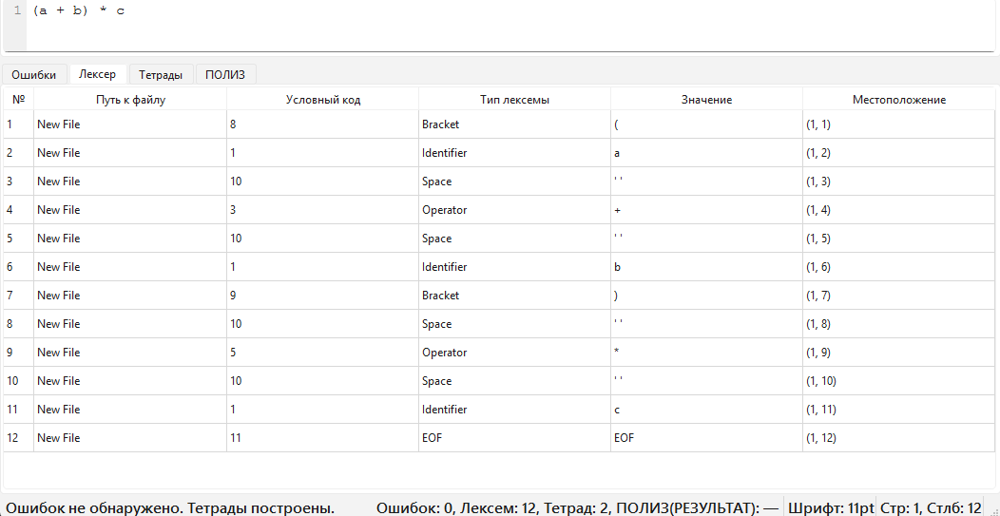
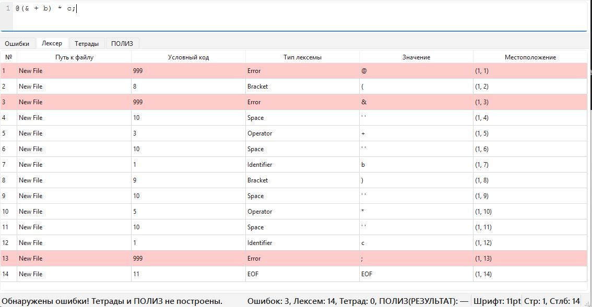
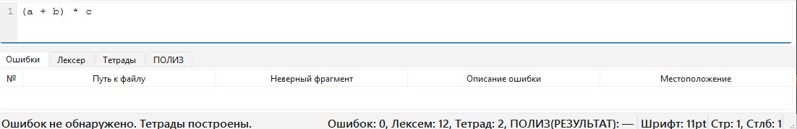
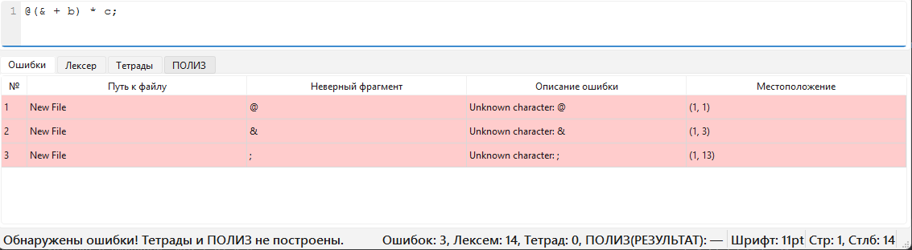
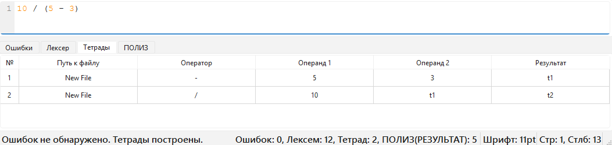
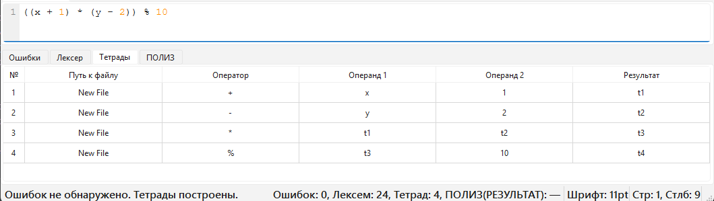
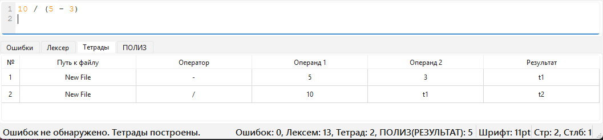
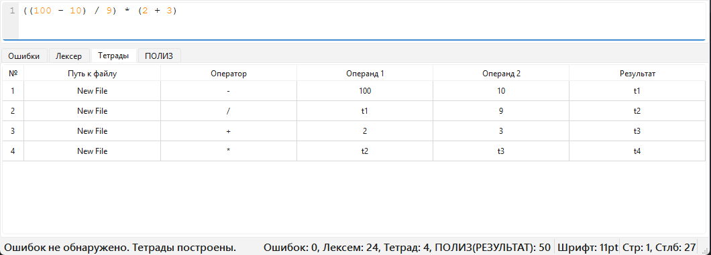

# Лабораторная работа 6. Создание внутренней формы представления программы
## Цель работы
Изучить методы построения внутреннего представления программы (ВПП) на основе контекстно-свободной грамматики, реализовать
синтаксический анализатор методом рекурсивного спуска и преобразовать арифметические выражения в тетрады и ПОЛИЗ.
## Сведения об авторе
Лабораторную работу выполнила студентка группы АВТ-313, Ижболдина Виолетта
## Вариант задания
### Язык программирования:
Swift
### Определение КС-граммитики:
````
1. E → TA
2. A → ε | + TA | - TA
3. T → FB
4. B → ε | * FB | / FB | % FB
5. F → num | id | (E)
6. id → letter {letter | digit | _ }
7. num → digit {digit}
````
### Примеры корректных строк: 
(a + b) * c

10 / (5 - 3)

((100 - 10) / 9) * (2 + 3)

((x + 1) * (y - 2)) % 10

## Лексические и синтаксические ошибки 
### Диаграмма лексера

### Схема рекурсивного спуска


### Скриншоты работы лексера 
Строка без ошибок: (a + b) * c 


Строка с ошибками: @(& + b) * c;


### Скриншоты работы парсера
Строка без ошибок: (a + b) * c


Строка с ошибками: @(& + b) * c;


## Внутренняя форма представления программы (тетрады)
Строка: 10 / (5 - 3)


Строка: ((x + 1) * (y - 2)) % 10


## ПОЛИЗ
Строка: 10 / (5 - 3)


Строка: ((100 - 10) / 9) * (2 + 3)
