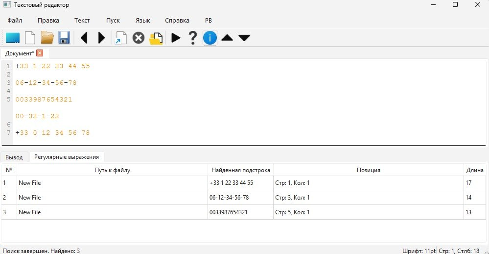
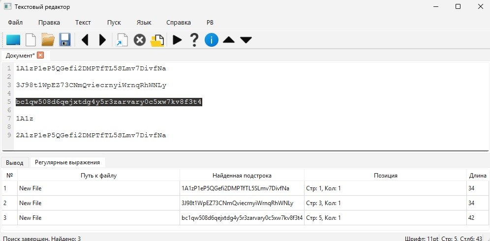
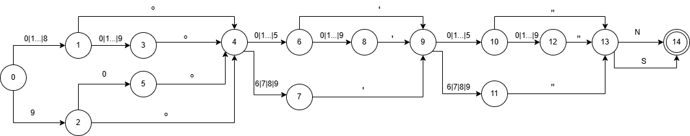
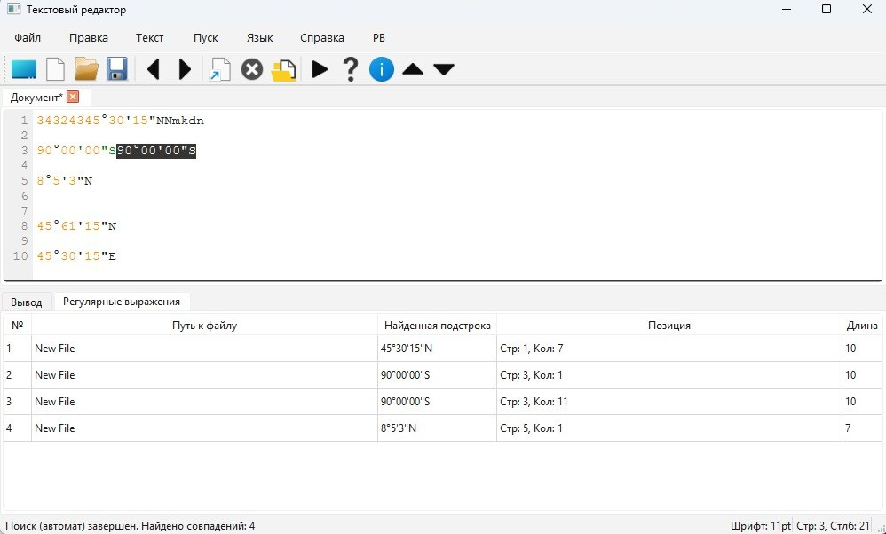

# Лабораторная работа 4. Реализация алгоритма поиска подстрок с помощью регулярных выражений
## Цель работы
Изучить теоретические основы регулярных выражений 
и их применение для поиска и извлечения подстрок из текста.
Освоить практические навыки использования библиотечных средств работы с регулярными выражениями, а также интеграцию алгоритмов поиска 
в графический интерфейс приложения.
## Сведения об авторе
Лабораторную работу выполнила студентка группы АВТ-313, Ижболдина Виолетта
## Постановка задачи
Разработать модуль поиска подстрок с использованием регулярных выражений, интегрировать его в 
существующее приложение (текстовый редактор) и обеспечить наглядный вывод результатов.
### Вариант задания

3 - Построить РВ для валидации французских номеров телефонов.

12 - Построить РВ, описывающее биткоин-адрес или MultiSig биткоин-адрес.

17 - Построить РВ, описывающее широту в формате градусы/минуты/секунды, например 45°30'15"N (учесть диапазон корректных значений).

## Решение трех задач
### 1.Валидация французских номеров телефонов
### Описание задачи
Построить РВ для валидации французских номеров телефонов.
### Регулярное выражение с пояснением каждого обозначения
(?:\+|00)?(?:33|0)\s*[1-9](?:[\s-]*\d{2}){4}
1. (?:..) - группирует символы для обработки
2. \+ - поиск знака +
3. | - логическое ИЛИ
4. 00 - поиск двух нулей подряд
5. ? - делает предшествующую группу необязательной
6. (?:33|0) - ищет либо код страны 33, либо префикс 0 для внутренних звонков
7. \s* - допускает любое кол-во пробелов
8. [1-9] - ограничивает ввод (т.к первая цифра номера не может быть нулем)
9. [\s-]* - объединяет пробел и дефис в один символьный класс 
10. \d{2} - ищет любое двузначное число
11. {4} - оператор повторения всей группы

### Примеры строк, которые должны находиться
+33 1 22 33 44 55

06-12-34-56-78

0033987654321
### Примеры строк, которые не должны находиться
00-33-1-22 - слишком короткая строка

+33 0 12 34 56 78 - после префикса не может идти 0
### Тестовые примеры

---
### 2.Биткоин-адрес
### Описание задачи
Построить РВ, описывающее биткоин-адрес или MultiSig биткоин-адрес.
### Регулярное выражение с пояснением каждого обозначения
(?:[13][a-km-zA-HJ-NP-Z1-9]{25,34}|bc1[ac-hj-np-z02-9]{11,71})
1. (?:..) - группирует символы для обработки
2. [13] - строка должна начинаться либо с цифры 1, либо с цифры 3
3. [a-km-zA-HJ-NP-Z1-9] - алфавит Base58 ( тут перечислены все разрешенные символы)
4. {25,34} - указывает, что предыдущий набор символов должен повториться от 25 до 34 раз
5. | - логическое ИЛИ
5. bc1 - адрес обязан начинаться с этой последовательности символов (для Bech32)
6. [ac-hj-np-z02-9] - алфавит Bech32
7. {11,71} - указывает, что предыдущий набор символов должен повториться от 11 до 71 раза
### Примеры строк, которые должны находиться
1AzP1eP5QGefi2DMPTfTL5SLmv7DivfNa

3J98t1WpEZ73CNmQviecrnyiWrnqRhWNLy

bc1qw508d6qejxtdg4y5r3zarvary0c5xw7kv8f3t4
### Примеры строк, которые не должны находиться
1A1z - слишком короткая строка 

2A1zP1eP5QGefi2&DMPTfTL5SLmv7DivfNa - содержит запрещенный символ O
### Тестовые примеры

---
###  3.Широта в формате градусы/минуты/секунды
### Описание задачи
Построить РВ, описывающее широту в формате градусы/минуты/секунды, например 45°30'15"N (учесть диапазон корректных значений).
### Регулярное выражение с пояснением каждого обозначения
(?:[0-8]?\d|90)°[0-5]?\d'[0-5]?\d"[NS] 
1. (?:..) - группирует символы для обработки
2. [0-8]? - опциональная первая цифра (от 0 до 8)
3. \d - обязательная вторая цифра (от 0 до 9)
4. | - логическое ИЛИ
5. 90 - если число не попало в диапазон 0–89, оно может быть строго 90
6. ° - символ градуса
7. [0-5]? - опциональная первая цифра минут (не может быть больше 5)
8. \d — вторая цифра (от 0 до 9)
9. ' - символ обозначение минут
10. [0-5]? - опциональная первая цифра секунд (не может быть больше 5)
11. \d - вторая цифра (от 0 до 9)
12. " - символ обозначение секунд
13. [NS] - строка должна заканчиваться либо буквой N, либо S
### Примеры строк, которые должны находиться
45°30'15"N

90°00'00"S90°00'00"S

8°5'3"N
### Примеры строк, которые не должны находиться
45°61'15"N - минут не может быть больше 59

45°30'15"E - неверно, широта бывает только северной (N) или южной (S)
### Граф автомата 

### Тестовые примеры
