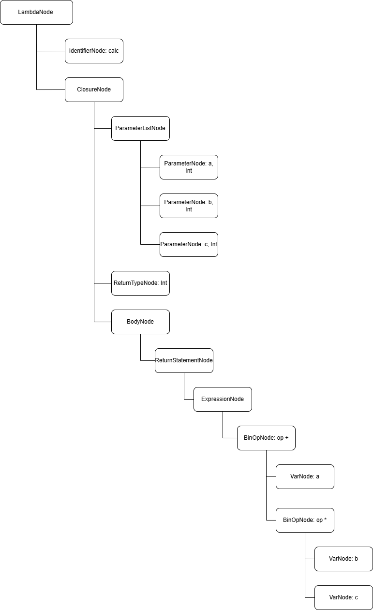

# Лабораторная работа 7. Анализ и преобразование кода с использованием Clang и LLVM
## Цель работы
Познакомиться с инструментарием Clang и LLVM, освоить получение абстрактного синтаксического дерева (AST) и 
промежуточного представления (LLVM IR) для кода на C/C++, научиться применять базовые оптимизации, 
строить графы потока управления (CFG), 
а также анализировать влияние оптимизаций на различные синтаксические конструкции языка.
## Сведения об авторе
Лабораторную работу выполнила студентка группы АВТ-313, Ижболдина Виолетта
## Постановка задачи
### Общее задание

Необходимо выполнить следующие шаги:
1. Установка среды  
Установить Clang, LLVM, opt и Graphviz (например, в Ubuntu 26.04).  
2. Работа с AST  
Сгенерировать абстрактное синтаксическое дерево для заданного C/C++‑файла.  
3. Генерация LLVM IR  
Получить промежуточное представление кода без оптимизаций (-O0) и с оптимизациями (-O2).  
4. Оптимизация IR  
Применить оптимизации с помощью opt и/или флагов Clang, сравнить изменения.  
5. Построение CFG  
Построить граф потока управления для одной или нескольких функций.  
6. Индивидуальное задание (по варианту)   
Выполнить анализ конкретной синтаксической конструкции в соответствии с вариантом. 
Сформулировать, как LLVM обрабатывает выбранную конструкцию, какие оптимизации применяются.
7. Выводы  
Ответить на контрольные вопросы  

Пример кода: 
```
#include <stdio.h>
int square(int x) {
 return x * x;
}
int main() {
 int a = 5;
 int b = square(a);
 printf("%d\n", b);
 return 0;
}
```

### Индивидуальное задание

Задания:
1. Получить AST, указав как представлена лямбда-функция.
2. Получить IR для -O0 и найти замыкание.
3. Получить IR для -O2 и указать, во что превратилась
лямбда-функция?
4. Постройте CFG.
5. Вывод: лямбда — синтаксический сахар или отдельный тип.
Сделайте вывод о том, являются ли лямбда-выражения отдельным типом
или “синтаксическим сахаром”?


Пример кода: 
```
int main() {
auto square = [](int x) -> int { return x * x; };
int a = 5;
int b = square(a);
return b;
}
```

## Общее задание
### Установка среды
Работа выполнялась в среде Ubuntu 24.04.   
Установлены следующие инструменты:
- clang - компилятор языка C/C++;  
- llvm - инструменты анализа и оптимизации кода;  
- opt - инструмент для работы с LLVM IR и применения оптимизаций;  
- Graphviz - инструмент для визуализации кода.  
Команды установки:   
sudo apt install clang llvm  
sudo apt install opt  
sudo apt install graphviz  


### Работа с AST
Исходный файл main.c     


Команда: clang -Xclang -ast-dump -fsyntax-only main.c


Получение AST:


### Генерация LLVM IR
Промежуточное представление LLVM IR с помощью команды: clang -S -emit-llvm main.c -o main.ll


### Оптимизация IR
Получение LLVM IR без оптимизаций с использованием флага -O0: clang -O0 -S -emit-llvm main.c -o main_O0.ll   


Промежуточное представление кода с комплексной оптимизацией среднего уровня O2: clang -O2 -S -emit-llvm main.c -o main_O2.ll     


Сравнение двух файлов: 


### Построение CFG
Команда для генерации оптимизированного LLVM IR: clang -O2 -S -emit-llvm main.c -o main.ll  
Команда для генерации .dot-файлов CFG для функций: opt -passes=dot-cfg -disable-output main.ll


Команды для преобразования файлов с расширением .dot в .png с помощью Graphviz:

dot -Tpng .main.dot -o cfg_main.png   
dot -Tpng .square.dot -o cfg_square.png


CFG для функции main и square:


## Индивидуальное задание
### Получение AST
Исходный файл lambda.cpp   


Команда для получения AST: clang++ -Xclang -ast-dump -fsyntax-only lambda.cpp


### Получение IR для -O0 
Получение IR для -O0: clang++ -O0 -S -emit-llvm lambda.cpp -o lambda_O0.ll  


На уровне IR без оптимизаций видно, что лямбда реализуется как анонимную структуру.
Компилятор создает анонимную структуру %class.anon (само замыкание) и отдельную функцию с манглированным именем,
содержащую тело лямбды. В функции main под объект замыкания выделяется память на стеке через alloca, а
вызов происходит с передачей этого объекта в качестве первого аргумента. Это подтверждает, 
что на уровне IR лямбда превращается в стандартный функциональный объект - экземпляр анонимного класса с 
методом вызова.


### Получение IR для -O2
Получение IR для -O2: clang++ -O2 -S -emit-llvm lambda.cpp -o lambda_O2.ll


При использовании оптимизации -O2 структура кода упрощается: 
компилятор применяет встраивание функций и свертку констант, в результате чего анонимный класс и 
отдельная функция полностью удаляются. Вся логика лямбды вычисляется еще на этапе компиляции, а в
итоговом IR-коде функции main остается лишь инструкция возврата готового результата. 


### Построение CFG
Построение CFG -O2 для лямбды: opt -passes=dot-cfg -disable-output lambda_O2.ll 


Построение CFG -O0 для лямбды: opt -passes=dot-cfg -disable-output lambda_O0.ll


### Вывод: лямбда — синтаксический сахар или отдельный тип?
Лямбда-выражение является «синтаксическим сахаром», а не отдельным встроенным типом данных. 
Анализ промежуточного представления показывает, что компилятор просто автоматизирует создание обычного 
класса с перегруженным оператором вызова.
Таким образом, лямбда-выражения не вводят новых механизмов на низком уровне, 
а лишь предоставляют удобный, краткий синтаксис для создания анонимных функциональных объектов, 
избавляя от необходимости писать шаблонный код классов вручную.

### Ответы на контрольные вопросы
**1. Что такое Clang, и какова его роль в процессе компиляции программ?**  
Clang - это фронтенд-компилятор для языков C, C++ и Objective-C. Его роль заключается в том, 
чтобы взять исходный текст программы, провести лексический, синтаксический и семантический анализ, 
построить абстрактное синтаксическое дерево и затем сгенерировать из него промежуточное представление.

**2. Что представляет собой LLVM и как он используется в современных компиляторах?**     
LLVM - это набор модульных и переиспользуемых технологий для построения компиляторов. 
В современных компиляторах LLVM используется как мощный движок оптимизации: 
он принимает независимый от языка LLVM IR, применяет к нему сотни различных алгоритмов оптимизации и затем генерирует 
машинный код (ассемблер) под конкретную архитектуру процессора.

**3. Чем отличается абстрактное синтаксическое дерево (AST) от промежуточного представления LLVM IR?**  
- AST - это древовидное представление структуры исходного кода. 
Оно сильно привязано к правилам конкретного языка (в нем есть классы, циклы for, if-else, лямбды и т.д.).  
- LLVM IR - это линейный набор низкоуровневых инструкций, похожий на ассемблер, но независимый от процессора. 
В нем нет сложных конструкций вроде for или class - только переходы, выделение памяти, простые арифметические операции и вызовы.

**4. Для чего необходимо промежуточное представление (IR) в процессе компиляции?**  
IR служит единым языком между фронтендом и бэкендом: на нём проводят разнообразные оптимизации, 
независимые от синтаксиса исходного языка и целевой архитектуры, а затем генерируют машинный код.

**5. Что делает инструкция alloc в LLVM IR, и зачем она используется в функциях?**  
Инструкция alloca выделяет память на стеке текущей функции для локальных переменных
и возвращает указатель на эту память. Она используется, потому что в LLVM IR виртуальные регистры 
(обозначаются через %) неизменяемы, а исходные переменные в C++ могут меняться (например, в циклах). 
alloca позволяет создать изменяемую область памяти для хранения таких переменных до того, как код будет оптимизирован.

**6. Зачем нужна оптимизация кода в компиляторе, и какие основные цели она преследует?**  
Оптимизация улучшает производительность, уменьшает размер кода, снижает потребление памяти и 
увеличивает энергоэффективность. Цель - преобразовать код так, чтобы он выполнялся быстрее или занимал меньше ресурсов, 
не изменяя поведение программы.

**7. Что такое SSA-форма и почему она важна при оптимизации программ?**  
SSA (Static Single Assignment) — это форма представления кода, где каждая переменная присваивается только один раз. 
Это упрощает анализ зависимостей, позволяет эффективнее проводить оптимизации, такие как устранение мёртвого кода и 
константная свёртка.

**8. Что такое граф потока управления (CFG) и как он помогает анализировать поведение программы?**   
Граф потока управления (CFG) — это структура, которая показывает, как может передаваться управление между
различными частями программы. Каждый узел графа соответствует базовому блоку кода (то есть последовательности инструкций
без ветвлений), а рёбра показывают возможные переходы. CFG используется для анализа логики выполнения, 
распознавания циклов, ветвлений и определения доступности кода.

**9. Как устроено представление арифметических операций в LLVM IR (например, умножение, сложение)?**  
Арифметические операции в LLVM IR представляются как простые инструкции, каждая из которых оперирует с переменными SSA. 
Например, сложение, вычитание или умножение задаются инструкциями add, sub, mul и принимают два аргумента. 
Результат всегда сохраняется в новой переменной. Это делает каждую операцию простой и понятной для анализа и оптимизации.

**10. Почему функции в LLVM IR обычно представляют собой отдельные единицы анализа и оптимизации?**  
Функции в LLVM IR считаются отдельными единицами, потому что они представляют собой логически изолированные блоки с 
чёткими границами, входами и выходами. Благодаря этому компилятор может оптимизировать каждую функцию отдельно, не 
затрагивая остальной код. Это упрощает реализацию локальных оптимизаций и улучшает масштабируемость компилятора.

**11. Что происходит с функцией в LLVM IR, если она вызывается один раз и очень короткая?**  
Такая функция может быть встроена прямо в место вызова, чтобы устранить накладные расходы вызова и улучшить возможности для последующих оптимизаций.

**12. Какие преимущества даёт использование IR и CFG для автоматических оптимизаций по сравнению с анализом исходного текста на C?**  
IR упрощает анализ и оптимизацию кода за счёт абстракции от синтаксиса C, а CFG даёт чёткое представление о потоке выполнения. 
Вместе они делают автоматические оптимизации эффективнее, универсальнее и проще в реализации, чем прямой анализ исходного текста на C.


## Дополнительное задание 
### AST конструкции


### Результаты оптимизаций


### Блок-схемы оптимизаций 
**Оптимизация 1: Свертка констант и алгебраические упрощения**    
Оптимизатор находит инструкции, где оба операнда являются числами, 
вычисляет их и подставляет результат. 
Дополнительно обрабатываются частные случаи: умножение на 1, умножение на 0 и сложение с 0.

**Оптимизация 2: Удаление мертвого кода**   
Оптимизатор работает в два прохода. 
На первом проходе собирается множество всех используемых переменных, 
которые встречаются в правых частях выражений или в инструкции return.
На втором проходе удаляются все инструкции присваивания временным переменным, 
если имя этой переменной не попало в список используемых.