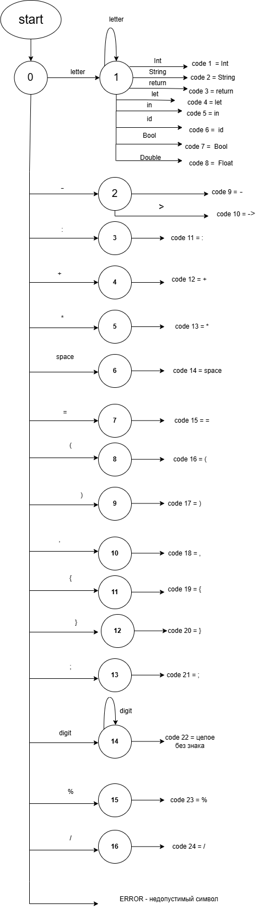
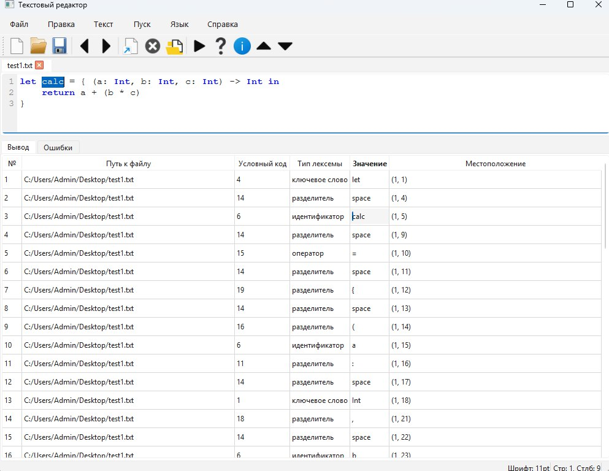
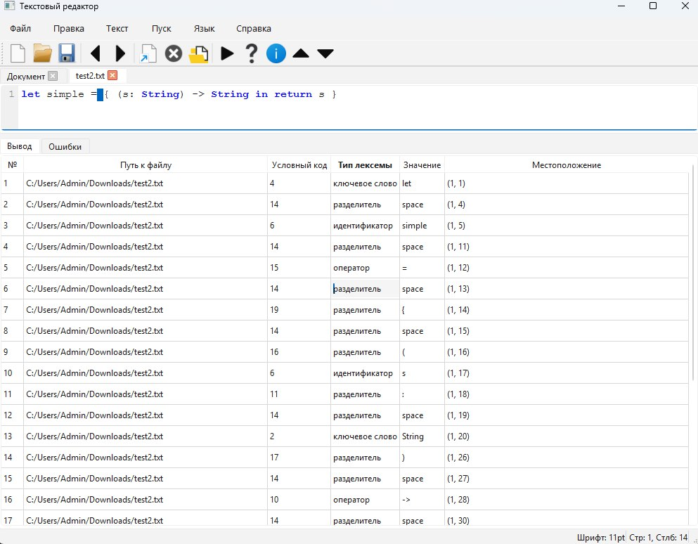
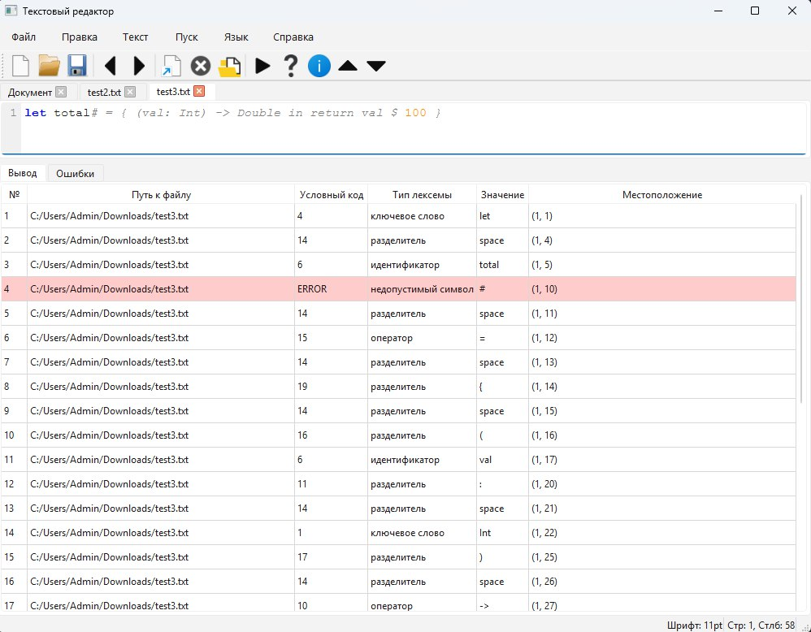

# Лабораторная работа 2. Разработка лексического анализатора (сканера)
## Цель работы
Изучить назначение и принципы работы лексического анализатора в структуре компилятора. Спроектировать алгоритм (диаграмму состояний) и выполнить программную реализацию сканера для выделения лексем из входного текста. Интегрировать разработанный модуль в ранее созданный графический интерфейс языкового процессора.
## Сведения об авторе
Лабораторную работу выполнила студентка группы АВТ-313, Ижболдина Виолетта
## Вариант задания
### Вариант:
87, Лямбда-выражение на языке Swift
### Примеры корректных строк: 
1. let calc = { (a: Int, b: Int, c: Int) -> Int in \
    return a + (b * c)\
}
2. let simple = { (s: String) -> String in return s }

### Перечень допустимых лексем
1. Ключевое слово - Int
2. Ключевое слово - String
3. Ключевое слово - return 
4. Ключевое слово - let 
5. Ключевое слово - in
6. Идентификатор 
7. Ключевое слово - Bool
8. Ключевое слово - Float 
9. Минус "-"
10. Стрелка "->"
11. Двоеточие ":"
12. Плюс "+"
13. Знак умножения "*"
14. Пробел 
15. Оператор присваивания "="
16. Левая круглая скобка "("
17. Правая круглая скобка ")"
18. Запятая ","
19. Левая фигурная скобка "{"
20. Правая фигурная скобка "}"
21. Точка с запятой ";"
22. Целочисленное число 
23. Оператор остатка от деления "%"
24. Оператор деления "/"

## Диаграмма состояний
### Конечный спроектированный автомат

### Краткое описание работы автомата
Сканер поочередно считывает символы кода, объединяя буквы в ключевые слова 
Swift или идентификаторы, а цифры — в целые числа. В результате формируется упорядоченный список 
токенов с указанием их типа и позиции, а любые недопустимые знаки фиксируются как ошибки.

## Тестовые примеры 
Пример 1 (корректная строка): let simple = { (s: String) -> String in return s }

Пример 2 (многострочный пример): let calc = { (a: Int, b: Int, c: Int) -> Int in \
    return a + (b * c)\

Пример 3 (некорректная строка): let total# = { (val: Int) -> Double in return val $ 100 }
